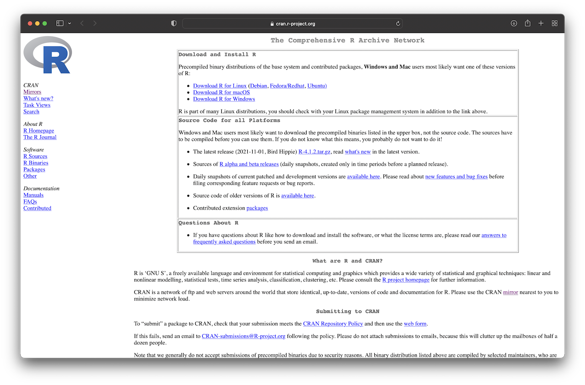
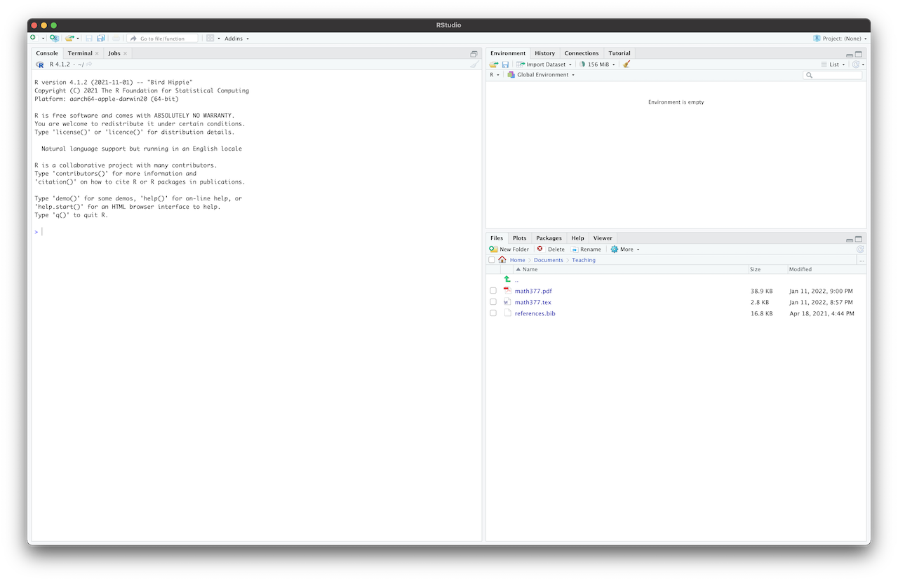

---
output:
  html_document: default
  pdf_document: default
---
# Introduction to R

## Installation

R is a free software environment for statistical computing and graphics. It compiles and runs on a wide variety of UNIX platforms, Windows and macOS. To help you write code in R, RStudio is a free application that makes the task significantly easier.
To get started, you need to acquire your own copies of these two programs.

### Installation of R

We start with the installation of R. The basic files for installation and packages can be found on the CRAN website, <http://cran.r-project.org/> as shown in Figure \@ref(fig:cran) below.

```{r cran, echo = FALSE, fig.align = 'center', out.width = '65%', fig.cap= " \"The Comprehensive R Archive Network\" webpage. "}

```

For Windows users, click "Download R for Windows". Then, you will obtain a screen similar to Figure \@ref(fig:winstall) (left) below. Next, click the “base” link. After that, click on the link at the top of the page that should say something like “Download R 4.1.2 for Windows” (see Figure \@ref(fig:winstall), right). This will download an executable file for installation. Finally, open the executable and follow the installation wizard. 

```{r winstall, echo = FALSE, fig.align = 'center', fig.show="hold", out.width = '49%', fig.cap= "Download R for Windows."}
knitr::include_graphics(c("figures/windows_install.png", "figures/windows_install2.png"))
```

For macOS users, click "Download R for macOS". This will take you to a screen similar to Figure \@ref(fig:macinstall). Then, depending on your computer, click "R-4.1.2.pkg" for Mac computers with Intel processor or "R-4.1.2-arm64.pkg" for Mac computers with Apple silicon. This will download an installation file. Finally, open the file and follow the installation steps. 

```{r macinstall, echo = FALSE, fig.align = 'center', out.width = '65%', fig.cap= "Download R for macOS. "}
knitr::include_graphics("figures/macos_install.png")
```

If you followed the steps above, you should be able to open R. When starting R, a screen similar to Figure \@ref(fig:rinitial) should appear.

```{r rinitial, echo = FALSE, fig.align = 'center', out.width = '65%', fig.cap= "R console."}
knitr::include_graphics("figures/rproject.png")
```

::: {.remark}
The steps above refer to version 4.1.2 of R, which corresponds to the most recent version at the time of writing. However, you should download the most current release of R. 
:::

### Installation of Rstudio 


Although the editor of R works fairly well, you should consider running R with RStudio. We will use RStudio because it makes using R much easier, and you get access to many useful functionalities. For instance, these lecture notes were written using Rstudio. To download your copy, go to the Rstudio download page <https://www.rstudio.com/products/rstudio/download/>. Then, click "Download" under the heading "Rstudio Desktop" (see Figure \@ref(fig:rstudiodown), left). This will take you to a screen similar to Figure  \@ref(fig:rstudiodown) (right), where the top link is the installer recommended according to your system. If this is incorrect, you can select the appropriate one from the installers list. Download the installation file, open it, and follow the installation steps. 


```{r rstudiodown, echo = FALSE, fig.align = 'center', fig.show="hold", out.width = '49%', fig.cap= "Download Rstudio."}
knitr::include_graphics(c("figures/rstudio_download1.png", "figures/rstudio_download2.png"))
```

Test the installation by opening Rstudio. You should see a screen similar to Figure \@ref(fig:rstudio).

```{r rstudio, echo = FALSE, fig.align = 'center', out.width = '65%', fig.cap= "Rstudio."}

```


::: {.remark}
Note that, even if you use RStudio, you still need to download and install R. RStudio runs the version of R installed on your computer, and it does not come with a version of R on its own.
:::

##  R as a simple calculator

We will start by using R as a calculator. To run R code, go to the **console** tab (bottom left in the default Rstudio arrangement). You will see a ``>`` symbol, called the **prompt**. Now, type ``1 + 2`` after the prompt and press Enter. RStudio will display:
```
> 1 + 2
[1] 3
```
The ``[1]`` that appears next to your result indicates that the line starts with the first value in your result. There are commands that return more than one value, and their results may show up in multiple lines. For instance, type the command ``10:50``, which produces 51 integer values from 10 to 50. You will see something like the following:
```
> 10:50
[1] 10 11 12 13 14 15 16 17 18 19 20 21 22 23 24 25 26 27 28 29 30 31 32
[24] 33 34 35 36 37 38 39 40 41 42 43 44 45 46 47 48 49 50
```
Here, ``[24]`` indicates that the second line starts with the 24th value. We will come back to the ``:`` operator later.  

If you type an incomplete command and hit Enter, R will display a ``+`` prompt. This means that R is waiting for the rest of your command. At this stage, you can finish the command and press Enter or hit the Escape key to start over. 

```
> 2 - 
+ 3 +
+ 5
[1] 4
```

In what follows, the code will be shown in this way:

``` {r}
1 + 2
```
Note that we no longer display the prompt, and that the results are presented after two hashtags (``##``). The reason is that this makes it easier for you to copy and paste the code into your R console. 

Returning to using R as a calculator, Table \@ref(tab:aoperator) shows the arithmetic operators available in R. 

``` {r, aoperator, echo=FALSE}
d <- cbind(c("Addition", "Subtraction", "Multiplication", "Division", "Power", "Integer division", "Modulus (remainder of integer division)"), c("+", "-", "*", "/", "^", "%/%", "%%"))

#knitr::kable(d, caption = "Arithmetic operators.", format = "latex", booktabs = TRUE)
knitr::kable(d, caption = "Arithmetic operators.", booktabs = TRUE)
```

Lets now try some simple operations:

``` {r}
3^2 + 4 * 10
(3^2 + 4) * 10
```
You need to be aware that the precedence for arithmetic operators in R follows the BODMAS order: Brackets ( ), Orders ^, Division / and Multiplication *, Addition + and Subtraction -.

::: {.remark}
If you want to learn more about how R gives precedence to all operators, type ``?Syntax`` in the console.
:::

If you make a mistake in your code, R will let you know and indicate what the error is.
``` {r, error=TRUE}
3 + *
```

::: {.example #pv}
Find the present value of an investment that gives 1 in 5 years, assuming that the interest rate is $r=3\%$ compounded annually. 
:::

::: {.solution} 
$\,$
```{r}
(1 + 0.03)^(-5) 
```
:::


R also has common constants and mathematical functions that you may need. These include the exponential and log functions ``exp()`` and ``log()``, trigonometry functions such as ``sin()`` and ``cos()``, among others. 

```{r}
pi

cos(2 * pi)

log(10) # The default option is base e
```
You can look at the full description of a function in R by using the "help". Let us try this with the ``log()`` function. Type ``help(log)`` or ``?help``. This will display the documentation of the ``log()`` function in the tab **Help** (bottom right). Here, you will find out that ``log()`` computes by default the natural logarithm. Moreover, looking at the rest of the documentation, you will see that ``log()`` has *arguments* ``log(x, base = exp(1))``.  When calling the function, you can specify the argument names. In such a case, then the order does not matter:

```{r}
log(x = 4, base = 10)

log(base = 10, x = 4)
```

However, if you do not specify the argument names, R will decide that *x* is the first argument, and *base* is the second one. 

```{r}
log(4, 10)
log(10, 4)
```

If you try to do an operation that is not mathematically defined, R will return ``NaN`` (Not a Number).
```{r}
log(-2)
0 / 0
```

### Logical operators

Logical operators help evaluate certain conditions. For instance, we may be interested in checking if an insurance claim is greater than (``>``) a given deductible. If this is "true," then the insurance company may pay the amount above the deductible. In Table \@ref(tab:loperator) you can find a list of logical operators in R. These operators return a *Boolean* value of either ``TRUE`` or ``FALSE``. 

``` {r, loperator, echo=FALSE}
d <- cbind(c("Less Than", "Less Than or Equal To", "Greater Than", "Greater Than or Equal To", "Equal To", "Not Equal To", "Not", "Or", "And"), c("<", "<=", ">", ">=", "==", "!=", "!", "|", "&"))

#knitr::kable(d, caption = "Arithmetic operators.", format = "latex", booktabs = TRUE)
knitr::kable(d, caption = "Logical operators.", booktabs = TRUE)
```
Following you can see some simple examples: 
```{r}
4 <= 3

1 == 1

(3 != 2) & !(1 > 1)
```


## R objects

An essential part of any  programming language is the ability to store information in variables. R lets you save data by storing it inside an R object. An object is just a name that you can use to call up stored data. First, we need to see how to create objects. 

### Assignment
Objects in R are created using the assignment operator ``<-``, that is, the less than symbol, ``<``, followed by a minus sign, ``-``. Simply choose a name followed by ``<-`` and the information you want to store. For example:

```{r}
x <- 1
```
Your variable will now be part of what is called the “working space.” You can print the value stored in this variable type its name
```{r}
x
```
or you can use the ``print()`` function
```{r}
print(x)
```

```{r, echo = FALSE}
rm(list = ls())
```


Make sure that the assignment operator is well written, otherwise, you may obtain an error:
```{r, error=TRUE}
x < -1
```

There are a few rules regarding the name of an object in R. First, a name cannot start with a number. Second, a name cannot use some special symbols, like ``^``, ``!``, ``$``, ``@``, ``+``, ``-``, ``/``, or ``*``. Other than that, you can name your variables in any way you want. However, it is convenient to choose a name that will help you (and others) easily read your code. Note also that R is also case-sensitive. This means that in the following code, the variables ``my_variable`` and ``My_variable`` are different objects:

```{r}
my_variable <- 1
My_variable <- 2
my_variable
```

If you use a name that is already taken, R will overwrite any previous information stored in that object:
```{r}
x <- 3
x
```
```{r}
x <- 10
x
```

Hence, it is good to check if the names you will use are already taken. You can see which object names you have already used with the function ``ls`` or in the **Environment** tab of Rstudio:
```{r}
ls()
```
You also need to be careful of not using the name of a function or constant that is already in R. This can lead to hard-to-identify errors or incorrect outputs: 
```{r}
pi <- 10 

sin(2 * pi)
```

To remove specific objects from the working space you can use the ``rm()`` function:
```{r}
rm(my_variable)
ls()
```
In RStudio, ensure the Environment tab is in Grid (not List) mode. Tick the object(s) you want to remove from the environment. Click the broom icon.

To clean the whole working space, type
```{r}
rm(list = ls())
ls()
```
or click the broom icon in the Environment tab (list mode) in Rstudio.

::: {.remark}
Objects can also be created using ``=`` instead of ``<-``. Although ``=``  is simpler to type, we do not recommend using it since it will make your code more difficult to read. Alternatively, you can use the shortcut ``alt/opt`` + ``-`` to generate ``<-``.
:::

Just as you performed calculations with numbers in the previous section, you can do the same with objects containing numbers references. Let us come back to Example \@ref(exm:pv). An alternative solution using objects would be as follow:

```{r}
maturity <- 5
r <- 0.03
(1 + r)^(-maturity)
```
As your analysis gets more complicated, you may want to save the results to access them later.

```{r}
pv <- (1 + r)^(-maturity)
pv
```
For instance, if you now want to compute the present value of an investment that gives 75 at the end of 5 years (assuming the same 3% interest rate), you can simply type:
```{r}
75 * pv
```

Let us imagine that you need to repeat the analysis above, but this time using different inputs (for instance, a different interest rate). If you used the console solely, you would need to go back in the console history, change where needed, and rerun the rest of the code. This is particularly complicated when you have several lines of code. Hopefully, you can use **scripts**  to avoid this situation. To open a new script go to ``File`` -> ``New File`` -> ``R script``. This will open a new script. Here you can write your code and run it afterward using shortcuts such as Cmd+Enter or using the **Run** button in Rstudio.  

### Data types

R has different types of variables. These are the ones that are commonly used:

1. Numeric - Any number in $\mathbb{R}$.
4. Complex - Complex numbers ($\mathbb{C}$)
2. Character - Collection of characters. For instance, the name of a student.
3. Logical - TRUE and FALSE

A difference between R and other programming languages, such as C++, is that we can declare a variable without specifying its type. Instead, R will automatically determine the type. 

#### Numeric {-}

R is equipped with useful functions that can be used to find the type of a variable. For instance, the ``class()`` function:
```{r}
x <- log(2)
x
class(x)
```
We can also check if a variable is of a certain type:
```{r}
is.numeric(x) # check whether the data x is numeric
is.character(x) # check whether the data x is character
```
R can store data only up to a certain point. This means that, for instance, $\pi$, which has an infinite decimal representation, is computed up to a finite number of decimal points. This is the reason why expressions such as the next one do not give exactly 0 as a result:
```{r}
exp(log(10)) - 10
```
R has a special command to represent infinity: ``Inf``. You can check which is the largest number below ``Inf`` using
```{r}
.Machine$double.xmax
```
Any number above this will be converted to ``Inf``.
```{r}
2e+308
```
You can use logical operators to check if a number is below ``Inf``.
```{r}
2e+308 < Inf
2e+306 < Inf
```

:::{.remark}
The above notation using ``e``, is to specify scientific notation in R. For instance,
```{r}
2e+2 # This corresponds to 2 * 10^2
3.5e-1 # This corresponds to 3.5 * 10^(-1)
```
:::


``Inf`` can also be used in calculations and to represent certain quantities
```{r}
1 / 0

1 / Inf
```

::: {.remark}
It is possible to work with **integers** in R. To specify that a number is an integer, you need to type ``L`` after the number:
```{r}
x <- 2L
class(x)
```
However, when performing computations, integers can easily be converted to numeric objects. Hence, it is very likely that you will never need to work with integers. 
```{r}
y <- 1 * x
class(y)
```


:::


#### Complex {-}
A complex number is specified by adding the suffix i.

```{r}
x <- -3i
x
class(x)
```
You need to make sure to include a number before i, otherwise, R will try to look for an object.
```{r, error=TRUE}
x <- i
```
The order of real and complex parts does not matter.
```{r}
x <- 2 - 1i
x
y <- -1i + 2
y
```
You can check if a variable is complex
```{r}
is.complex(x)
is.numeric(x)
```
and perform calculations
```{r}
x + y
```
R has some built-in functions to transform the type of data. For instance, we could use ``as.numeric()`` to try to transform a complex into a numeric
```{r}
as.numeric(x)
```
Note that a warning message is displayed, indicating that R only took the real part. 

#### Character {-}
A character string is specified by using quotation marks (``"``).
```{r}
x <- "Hello world"
x
class(x)
```
You can use single (``'``) or double (``"``) quotes, but not a mix.

```{r, error=TRUE}
x <- "Actuarial"
x
y <- 'Mathematics'
y
```
```{r, error=TRUE}
z <- 'Mix"
```
To concatenate two character strings, we can use the ``paste()`` function :
```{r}
paste(x, y)
```
Note that by default, ``paste()`` puts a space between the two character strings. You can change this by using the ``sep`` argument:
```{r}
paste(x, y, sep = ".")
```
You can convert numeric variables into character variables by using the ``as.character()`` function.
```{r}
x <- 2
as.character(x)
```
It is also possible to pass from character to numeric.
```{r}
x <- "2"
as.numeric(x)
```
Finally, try the following code:
```{r}
x <- "Hola"
as.numeric(x)
```
This will produce a ``NA`` (short for Not Applicable). ``NA`` is used to represent missing values, or unknown values, in R. 

#### Logical {-}
We have already mentioned the logical constants ``TRUE`` and ``FALSE``, when describing logical operators. These can also be stored in an object as follows:
```{r}
x <- TRUE
x
class(x)
```
Alternative, you can use ``T`` and ``F``:
```{r}
y <- F
y
```
When converting a logical variable into a numeric variable, you will obtain 1 (TRUE) or 0 (FALSE):
```{r}
as.numeric(TRUE)
as.numeric(FALSE)
```
On the other hand, you can convert a numeric variable into a logical one using the ``as.logical()`` function. In such a case, any numeric value different to 0 will be converted to TRUE and only 0 to FALSE:

```{r}
as.logical(2.3)
as.logical(0)
```
When performing computation, R automatically transforms TRUE to 1 and FALSE to 0, which can be very useful. 

::: {.example}
A car insurance policy covers any losses above a deductible of 80. Compute the amount paid by the company if a claim for 100 is registered.
:::

::: {.solution}
$\,$
```{r}
deductible <- 80
claim <- 100
payment <- (claim > deductible) * (claim - deductible)
payment
```
:::

What if the claim was for 70?

```{r}
deductible <- 80
claim <- 70
payment <- (claim >= deductible) * (claim - deductible)
payment
```

## Vectors

Vectors are made of a set of objects. The ``c()`` function can be used to create vectors, and it is the easiest way to define and store more than one value in R. 

```{r}
x <- c(0, 2, 6, -1, -5, 1)
x
```
You can check if an object is a vector by using the function ``is.vector()``:
```{r}
is.vector(x)
```
In fact, we have been working with vectors (of length one) for quite some time:
```{r}
y <- 2
is.vector(y)
```
The ``c()`` function also allows you to give other vectors as inputs,
```{r}
x <- c(c(0, 2), c(6, -1), -5, 1)
x
```
In that case, it will concatenate the vectors.

There are other ways to generate (numeric) vectors. Next, we describe how to use the ``rep()`` and ``seq()`` functions to do so.
Let us start with the function ``rep(x, times)``, which repeats ``x`` the number times specified by ``times``.
```{r}
rep(1, 4)
```
You can give a vector as input
```{r}
rep(c(1, 2), 4) # repeats c(1, 2) four times
```

Next, we will use the function ``seq(from, to, by, length.out)`` to generate sequences of numbers.  Note that this function has four arguments, and the output will depend on the values provided for these arguments.
If we want to generate a sequence of integers from 10 to 20, we can type:
```{r}
seq(from = 10, to = 20, by = 1)
```
Remember that if we omit the names of the arguments, R will take them in the order provided. So, the following code will provide the same output:
```{r}
seq(10, 20, 1)
```
As a matter of fact, if you look at the documentation of ``seq()``, you can see that the default value of ``by`` is 1, so we can simply type:
```{r}
seq(10, 20)
```
Sequences of integers are extensively used in R programming. That is why we have the shortcut operator ``:`` (you may remember this) to produce the same result:
```{r}
10:20
```
Let us try now with a different increment:
```{r}
seq(1, 5, by = 0.1)
```
The fourth argument ``length.out`` can be used to specify the number of values to generate. The increment will be adjusted accordingly to obtain precisely the given number. 
```{r}
seq(1, 5, length.out = 10)
```

So far, we have only created numeric vectors. However, it is also possible to create vectors of the other data types.
```{r}
x <- c("string1", "string2")
x
x <- c(FALSE, TRUE)
x
x <- c(1 + 2i, 3 - 2i)
x
```
We can also check the data type of a vector
```{r}
x <- c("string1", "string2")
class(x)
is.numeric(x)
```
At this point, you may be wondering what happens when you mix objects. Try it for yourself:

```{r, eval=FALSE}
class(c(2.5, "string"))
class(c(TRUE, 10))
class(c("string", FALSE))
class(c(2.5, 1i))
```

You will see that the assignment hierarchy is given as follows: character > complex > numeric > logical.

### Accessing vector elements

To access and modify elements of a vector, we can employ ``[]``. It is important to point out that, in stark contrast to other programming languages (e.g., C++), where the vector index starts in 0, in R, the index begins in 1. Hence, if we want to access the first element of a vector, we need to write:

```{r}
x <- c(0, 2, 6, -1, -5, 1)
x[1]
```
This also allows you to change the value of that element: 
```{r}
x[1] <- 10
x
```
If you try to access an element beyond the last element, you will get ``NA``:
```{r}
x[10]
```
To obtain the size (or length) of a vector, you can use the function ``length()``:
```{r}
length(x)
```
Thus, one way to access the last element of a vector is the following:
```{r}
x[length(x)]
```
We may be interested on selecting multiple elements. There are different ways to do it, depending on what is required. Consider the vector
```{r}
x <- c(0, 2, 6, -1, -5, 1)
```
To access the second and third elements, we can type
```{r}
x[c(2, 3)]
```
To obtain the elements from positions 2 to 5, we can run:
```{r}
x[2:5]
```
We can use negative numbers if we require all the vector entries except for certain elements. For instance, the following code returns the whole vector without the first element:
```{r}
x[-1]
```
For multiple elements:
```{r}
x[c(-1, -3)]
x[-c(1, 3)] # equivalently
```
It turns out that we can use logical indexing to subtract data, which is a very powerful tool. Let us start with a very simple example. Consider the vector
```{r}
x <- c(0, 2, 5)
```
If we type
```{r}
x[c(TRUE, FALSE, TRUE)]
```
we can see that R selects the entries with TRUE values. Now, take again the vector

```{r}
x <- c(0, 2, 6, -1, -5, 1)
```
We can use the logical operators to see, for example, which entries are nonnegative:
```{r}
x >= 0
```
Thus, if we want to subtract the nonnegative entries of that vector, we can type:
```{r}
x[x >= 0]
```
Alternatively, we can make use of the function ``which()``. This function returns the indices that give TRUE to a logical object. For example,
```{r}
which(x >= 0) # These are indices, not the values contained in the vector
```
Hence, we can subtract the non negative entries of that our vector as follows:
```{r}
x[which(x >= 0)]
```
If the length of the logical vector is different. R will "recycle" information:
```{r}
x[c(TRUE, FALSE)]
# Equivalent to
x[c(TRUE, FALSE, TRUE, FALSE, TRUE, FALSE)]
```

There are two other special cases that you need to know. If we put *nothing* inside ``[]``, we obtain the original vector
```{r}
x[]
```
If we put 0, then we obtain a vector of size 0, which is represented by ``numeric(0)``
```{r}
x[0]
```


### Operations with vectors
Now, we will review some operations involving vectors.

#### Scalars and vectors {-}
Let us start with operations between scalars (vectors of length one) and vectors.
```{r}
x <- c(0, 2, 6, -1, -5, 1)
x * 2
```
As you can see, R will return a new vector with the entries, the entries of the original vector multiplied by the given scalar. In the same way, we can make other operations:

```{r}
x / 4 + 2

x^2

2^x
```


#### Scalar functions applied to vectors {-}
If we apply a scalar function, such as ``exp()``, ``abs()`` (absolute value), ``round()``, etc., to a vector, R will compute such a function element-wise:
```{r}
exp(x)
abs(x)
```


#### Operations among vectors {-}

We can also perform operations among vectors. The operators typically work element-wise. Let us try first with the sum:
```{r}
x <- c(0, 2, 6, -1, -5, 1)
y <- c(1, -1, 2, 7, -2, 8)
x + y 
```
We can try other operators:
```{r}
x * y
x^y
```

If the vectors are of different sizes, R will *recycle* information. 
```{r}
x <- c(0, 2, 6, -1, -5, 1)
y <- c(1, -1)
x + y
# Equivalent to
x <- c(0, 2, 6, -1, -5, 1)
y <- c(1, -1, 1, -1, 1, -1)
x + y
```

Finally, we saw that the ``*`` operator performs element-wise multiplication. However, we may want to compute the inner product. This can be done with the ``%*%`` operator: 
```{r}
x <- c(0, 2, 6, -1, -5, 1)
y <- c(1, -1, 2, 7, -2, 8)
x %*% y
```
::: {.remark}
Recall that for two vectors $\mathbf{x} = (x_1, \dots ,x_n)$ and $\mathbf{y} = (y_1, \dots ,y_n)$, the inner product $<\mathbf{x}, \mathbf{y}>$ is defined as
$$
<\mathbf{x}, \mathbf{y}> = \sum_{i = 1}^n x_i y_i \,.
$$
:::


#### Some vector functions {-}
Data will be typically stored inside vectors. In order to analyze such data, we can make use of different R functions. For instance,  Table \@ref(tab:vecfn) shows some useful functions. 


``` {r, vecfn, echo=FALSE}
d <- cbind(c("``min()``", "``max()``", "``length()``", "``sum()``", "``mean()``", "``median()``", "``var()``", "``sd()``"), c("Minimum value in a vector", "Maximum value in a vector", "Number of elements in a vector", "Sum of the elements in a vector", "Mean of the elements in a vector", "Median of the elements in a vector", "Variance of the elements in vector", "Standard deviation of the elements in"))

knitr::kable(d, caption = "Some vector functions", booktabs = TRUE)
```

:::{.remark}
For given data $x_1, \dots ,x_n$, the ``mean()`` and ``var()`` functions compute the sample mean and variance given by
$$
\bar{x} = \frac{1}{n}\sum_{i = 1}^n x_i \,, \quad s^2_{n-1} = \frac{1}{n-1}\sum_{i = 1}^n (x_i - \bar{x})^2 \,,
$$
respectively.
:::

We can now compute several quantities of interest with all these functionalities at hand. 

::: {.example}
Let us assume that an insurance company have reported the following insurance claims:
```{r}
claims <- c(80, 20, 60, 55, 20.5, 100, 70, 89.9, 120)
```
How many claims were reported?
```{r}
length(claims)
```
How much is the total amount of claims?
```{r}
sum(claims)
```
For which amount are the minimum and maximum claim amounts?
```{r}
min(claims)
max(claims)
```
What is the average claim amount?
```{r}
mean(claims)
```
This can also be computer using the ``sum()`` and ``length()`` functions:
```{r}
sum(claims) / length(claims)
```
What is the standard deviation of the claims?
```{r}
sd(claims)
```
Again, this can be computed using other functions:
```{r}
sqrt(sum((claims - mean(claims))^2) / (length(claims) - 1))
```
If all these claims have a deductible of 50, and the insurance company pays the difference between a claim and the deductible if the former is larger. On average, how much does the company have to pay for the claims above the deductible?
```{r}
deductible <- 50
claims_to_pay <- claims[claims > deductible]
payment <- claims_to_pay - deductible
payment
mean(payment)
```

:::


## Matrices, data frames, and lists

### Matrices
Sometimes we are interested in storing information in a matrix form. The simplest way to generate a matrix is to use the ``matrix()`` function. This function has different arguments (see the help - ``?matrix``), so let us see how to use some of these options. The main argument of ``matrix()`` is  ``data``, which should be a data vector. 
```{r}
x <- matrix(c(1, 2, 3, 4, 5, 6))
x
```
Remember, if no further arguments are passed, R will execute the default option. In the above case, it creates a one-column matrix. The next two arguments are ``nrow`` and ``ncol``. These are used to define the dimension of a matrix:
```{r}
x <- matrix(c(1, 2, 3, 4, 5, 6), nrow = 3, ncol = 2)
x
y <- matrix(c(1, 2, 3, 4, 5, 6), nrow = 2, ncol = 3)
y
```
You can omit the argument names. Just remember that R will assign the input to the arguments in the order they are defined in the function. In this case, ``nrow`` first and ``ncol`` second (again, see help - ``?matrix``).
```{r}
x <- matrix(c(1, 2, 3, 4, 5, 6), 2, 3)
x
y <- matrix(c(1, 2, 3, 4, 5, 6), 3, 2)
y
```

Note that the above matrices are filled by columns (the default). If we want to change this, we can use the next argument ``byrow``. 
```{r}
x <- matrix(c(1, 2, 3, 4, 5, 6), nrow = 3, ncol = 2, byrow = TRUE)
x
y <- matrix(c(1, 2, 3, 4, 5, 6), nrow = 2, ncol = 3, byrow = TRUE)
y
```
In these notes, we will mainly use the default option of filling by columns. 

If we only specify one of the arguments, ``ncol`` or ``nrow``, R will attempt to find the other parameter from the length of the data. 
```{r}
x <- matrix(c(1, 2, 3, 4, 5, 6), ncol = 2)
x
y <- matrix(c(1, 2, 3, 4, 5, 6), nrow = 2)
y
```

Finally, if you specified the dimensions of the matrix and provided a vector of length larger than ``ncol`` x ``nrow`` ( i.e., the number of entries of the matrix), R will cut out the last elements.
```{r}
x <- matrix(c(1, 2, 3, 4, 5, 6, 7, 8), 3, 2)
x
```

The last argument, ``dimnames``, helps us give names to a matrix's rows and columns. 
```{r}
x <- matrix(c(1, 2, 3, 4, 5, 6), 3, 2, 
            dimnames = list(c("Row1", "Row2", "Row3"), c("Column1", "Column2")))
x
```

However, if you need to add names, we recommend using the ``colnames()`` and ``rownames()`` functions to keep your code clearer.
```{r}
x <- matrix(c(1, 2, 3, 4, 5, 6), nrow = 3, ncol = 2)
colnames(x) <- c("Column1", "Column2")
rownames(x) <- c("Row1", "Row2", "Row3")
x
```
::: {.remark}
Sometimes you will encounter matrices that are defined using data vectors created with the ``c()``  function applied multiple times. For instance,
```{r}
x <- matrix(c(c(1, 2, 3), c(4, 5, 6)), 3, 2)
x
```
The reason is that this "notation" can help you to distinguish the different columns of your input, so it is easier to read and identify mistakes.  Remember that ``c(c(1, 2, 3), c(4, 5, 6))`` produces the same vector as ``c(1, 2, 3, 4, 5, 6)``.
:::

You can verify if an object is a matrix using the ``is.matrix()`` function:
```{r}
x <- matrix(c(1, 2, 3, 4, 5, 6), 3, 2)
is.matrix(x)
y <- c(1, 2, 3)
is.matrix(y)
```

Another important function for matrices is ``dim()``. It has two functionalities. The first one is to tell the dimension of a matrix object.
```{r}
x <- matrix(c(1, 2, 3, 4, 5, 6), 3, 2)
dim(x)
```
If we only require the number of columns or rows, we can use the ``ncol()`` and ``nrow()`` functions:
```{r}
nrow(x)
ncol(x)
```

The second functionality of ``dim()`` is to transform vectors into matrices.
```{r}
x <- c(1, 2, 3, 4, 5, 6)
dim(x) <- c(3, 2)
x
```

A matrix can also be obtained by first generating two or more vectors  and then combining them using the ``cbind()`` or the ``rbind()`` functions. The ``cbind()`` function combine the vectors by making them columns of a new matrix: 
```{r}
x <- 2:5
y <- 9:6 
cbind(x, y) # Note that the columns have been named
```
While the ``rbind()`` function makes them rows: 
```{r}
rbind(x, y) # Note that the rows have been named
```

We can also create diagonal matrices by using the ``diag()`` function. 
```{r}
diag(c(1, 2, 3, 4))
```
To create an identity matrix, we simply type: 
```{r}
diag(4)
```


#### Accessing matrix elements {-}

To access elements of a matrix, we can use the ``[]`` notation. This is done in a similar way as in vectors, but in this case, we have to specify the rows and columns (``[row, column``]). 
```{r}
x <- matrix(1:6, 3)
x
x[3, 2]
```
We can also modify these values:
```{r}
x[3, 2] <- 8
x
```
If we want a whole row of the matrix, we leave the second argument blank:
```{r}
x[2, ]
```
Similarly, for columns: 
```{r}
x[, 1]
```
We can select multiple rows (or columns) using the ``c()`` function:
```{r}
x[c(1, 3), ]
x[c(1, 3), 2]
```
Negative values can be used to discart certain rows (or columns):
```{r}
x[, -2]
x[-c(1, 3), -2]
```
Additionally, we can also use logical operators to subtract data. For instance, consider the following matrix:
```{r}
x <- matrix(c(c(10, -2, 3), c(8, 0, -5)), 3, 2)
x
```
If, for example, we were required to subset the matrix in such a way that we only keep the rows with values in the first column that are non-negative, this can be done as follows: 
```{r}
x[x[, 1] >= 0, ]
```
What about subsetting the matrix in such a way that we only keep rows that has only non-negative in both columns: 
```{r}
x[x[, 1] >= 0 & x[, 2] >= 0, ]
```

Finally, if your matrix has column or row names, you can you those names to subtract information: 
```{r}
x <- matrix(c(1, 2, 3, 4, 5, 6), nrow = 3, ncol = 2)
colnames(x) <- c("Column1", "Column2")
rownames(x) <- c("Row1", "Row2", "Row3")
x
x["Row2", "Column1"]
x[c("Row2", "Row1"), "Column1"]
```
::: {.remark}
In the last example, you may have noticed that the output of the last command is a vector with names for its elements. You can also give names to the entries of a vector by using the ``names()`` function. For instance,
```{r}
x <- c(1,2)
names(x) <- c("name1", "name2")
x
```
However, this functionality is not used very often. 
:::

#### Operations with matrices {-}
Matrices behave pretty much in the same way as vectors when dealing with scalars and functions of scalars:
```{r}
x <- matrix(1:6, 3)
x
x^2 # Each element to the power 2
exp(x) # Exp applied element-wise
```
When working with matrices of the same dimension, the computations  will be performed element-wise:
```{r}
x <- matrix(1:6, 3)
x
y <- matrix(6:1, 3)
y
x + y
x^y
```
::: {.remark}
You can also perform calculations between vectors and matrices. Just be aware that R will recycle information to do so. For instance,
```{r}
x <- matrix(1:6, 3)
y <- c(0.5, 2)
x * y
# Equivalently
y <- matrix(rep(c(0.5, 2), 3), 3)
y
x * y
```
:::

There are other important operations among matrices. Let us review some of them. To perform matrix multiplication, we need to use the ``%*%`` operator (remember ``*`` is an element-wise product):
```{r}
x <- matrix(1:4, 2)
x
y <- matrix(4:1, 2)
y
x %*% y
```
The transpose of a matrix can be computed with the ``t()`` function:
```{r}
x <- matrix(1:6, 3)
x
t(x)
```
The inverse of a matrix can be obtained with the ``solve()`` function (we recommend to check the help for more detail ``?solve()``):
```{r}
x <- matrix(1:4, 2)
solve(x)
x %*% solve(x) # To check the result
```


We may also be performing operation column- or row-wise. For instance, compute the mean by row (or column). To do so, we can use vector functions in conjunction with the ``apply(X, MARGIN, FUN, ...)`` function. The argument of ``apply()`` are: ``X`` a matrix, ``MARGIN``, which can be 1 for rows, 2 for columns or ``c(1, 2)`` for rows and columns, and ``FUN`` the function to be applied. 
For instance, let us compute the mean by rows and columns:

```{r}
x <- matrix(1:6, 3)
x
apply(x, 1, mean)
apply(x, 2, mean)
```


:::{.remark}
Matrices can been seen as 2-dimensional arrays. We can create n-dimensional arrays by using the ``array()`` function. 
```{r}
x <- array(c(1:4, 11:14, 21:24), dim = c(2, 2, 3)) # Note that here we use dim for the dimensions
x
```

Acceding their elements is done in the same way as matrices, by using ``[]``.
```{r}
x[1, , ] 
x[, 1, ] 
x[, , 1]
```

However, array objects do not have the same versatility as matrices. 

:::

### Data frames
Matrices can store only one data type. However, we may want to save more than one type of data in a matrix type of format — for instance, students' names and their grades. Data frames allow you to do precisely that. To create a data frame, we use the ``data.frame()`` function.

```{r}
names <- c("student1", "student2", "student3", "student4")
grades <- c(90, 95, 85, 70)
students <- data.frame(names, grades)
students
```
Note that ``data.frame()`` have named the object's columns. You can check if an R object is a data frame with the ``is.data.frame()`` function:
```{r}
is.data.frame(students)
```


Data frames allow to access data using ``[]`` in the same way as matrices:
```{r}
students[1, ] # Information of first student
students[, 1] # Grades
students[2, 2] # Grades of second student
students[students[, 2] > 80, ] # Students with grades above 80
```
Data frames can also use the ``$`` operator to access data in a specific column. You simply type the name of the data frame object followed by the ``$`` operator and the column's name. For instance, 
```{r}
students$grades
```
Or access an specific element
```{r}
students$grades[1]
```
Alternatively, you can use the name of the column inside ``[]``:
```{r}
students[, "grades"]
```
The next thing that you want to do with a data frame is to add more information. This can be done with the ``cbind()`` function. For instance,
```{r}
age <- c(20, 21, 21, 19)
students <- cbind(students, age)
students
```
Alternatively, you can use the ``$`` operator:
```{r}
students$email <- c("st1@liv.co", "st2@liv.co", "st3@liv.co", "st4@liv.co")
students
```
Or even ``[]``:
```{r}
students[, 5] <- c(1, 2, 3, 4)
```

The names of the columns can be accessed (and changed) using the function ``names()``:
```{r}
names(students)
names(students)[5] <- "id"
students
```

### Lists
A list enables to store a variety of objects into a single one. In contrast to data frames, lists can contain different data types of different lengths. Lists can be generated in R by using the function ``list()``.

```{r}
month <- c("Jan", "Feb", "Mar")
value <- c(1.21, 1.245, 1.402)
type <- "monthly -interest -rate"
rate <- list(Month = month, Value = value, Type = type)
rate
```
The structure of a list object  can also be displayed (in more compact format) using ``str()``:
```{r}
str(rate)
```
As is the case with data frames, we can use ``$`` to access information: 
```{r}
rate$Value
rate$Month[1]
```
We can also use ``[]``. The notation, in this case, is slightly different:
```{r}
rate[[1]] # First element of a list, in this case, the months
rate[[2]][2] # Second value 
```
To add more data to a list, we can do it in different ways. First, using the ``$`` operator: 
```{r}
rate$Year <- 2021
str(rate)
```
And second, using ``[]``
```{r}
rate[[5]] <- c("UK")
str(rate)
```
Names can be handle in the same way as data frames. 
```{r}
names(rate)[5] <- "Country"
str(rate)
```


## Functions
So far, we have been only using built-in R functions. However, R also allows us to create our own functions. The basic syntax to define a new R function is shown below:
```
function_name <- function(arg1, arg2, ...) {
  statement(s)
}
```
Let us try a very simple example first: compute the area of a circle given it radius. An implementation would be the following: 
```{r}
area_circle<- function(radius) {
   pi * radius^2
}
```
We can now call our function:
```{r}
area_circle(2)
```

We now consider a slightly more complicated example:  Program the density function of an exponential distributed random variable $X$ with mean $\lambda^{-1}$, $\lambda >0$. Recall that this density function is given by
$$
f(x) = \lambda \exp(-\lambda x) \,, \quad x>0 \,.
$$
We write $X \sim Exp(\lambda)$.

We now require two inputs for our function: the parameter $\lambda$ and the point where we evaluate the density $x$. 
```{r}
den_exponential<- function(x, lambda) {
   lambda * exp(-lambda * x)
}
```
```{r}
den_exponential(1, 0.5)
```
When defining a function, we can give default values to the arguments. Let us make the default option of our exponential density, the standard exponential ,i.e., $\lambda = 1$:
```{r}
den_exponential <- function(x, lambda = 1) {
   lambda * exp(-lambda * x)
}
```
Thus, if we do not provide the function with the second parameter, it will use 1.
```{r}
den_exponential(1)
```
We now give some important considerations when working with functions:

- You can return the result of a function using the ``return()`` function. In our functions above, we did not make use of this function, and the reason is that, by default, R returns the result of the last evaluated expression.  However,``return()`` can be used for early returns. For instance, the function below terminates after the first line and returns 1, ignoring the second line.
```{r}
dummy_function <- function(x) {
  return(1)
  x * 2
}
dummy_function(10)
```
- You can create objects inside a function and these will be erased after executing the function
```{r, error=TRUE}
dummy_function <- function(x) {
  z <- 10
  x * z
}
dummy_function(10)
z 
```
- R will look for object in the global environment if they are not defined inside a function. 
```{r}
z <- 2
dummy_function <- function(x) {
  x * z 
}
dummy_function(10)
z # Keeps the value 2
```
However, if you create an object inside a function with the same name as an object in the global environment, the function will use the object defined inside the function's body. 
```{r}
z <- 2
dummy_function <- function(x) {
  z <- 5
  x * z
}
dummy_function(10)
z # Keeps the value 2
```

- R does not alter objects given as input of a function. Instead, it creates copies. 
```{r, error=TRUE}
x <- c(2, 6, 1, 9)
dummy_function <- function(x) {
  x <- sort(x)
  x
}
dummy_function(x)
x 
```


## Packages
R comes with a preloaded selection of functions. However, contributors can make their functions available via an R package. In fact, you can make your function available in the form of an R package. The general way to install a package in CRAN is as follows:

```
install.packages("package_name")
```
Try it by installign the ``actuar`` package: 
```{r, eval=FALSE}
install.packages("actuar")
```
You can install multiple package using ``c()``. 
```{r, eval=FALSE}
install.packages(c("ggplot2", "devtools"))
```


Once a package is installed, you need to call it using the ``library()`` command in order to access all its functionalities. 

```
library(package_name)
```
For instance, 
```{r, eval=FALSE}
library(actuar)
```

R packages in CRAN are updated regularly with new functions, fix bugs, performance improvements, etc. To update an R package, you can use the ``update.packages()`` function. The syntax is similar to ``install.packages()``, for instance

```{r, eval=FALSE}
update.packages(c("ggplot2", "devtools"))
```

If a package in CRAN is not updated regularly, it can be potentially be removed from CRAN. This means that sometimes, when a package has not been updated for a while, you will not be able to install it using ``install.packages()``. Try, for instance, with the ``CASdatasets`` package: 
```{r, eval=FALSE}
install.packages("CASdatasets")
```
However, the source code of an older version may be still available, and you can use that to install the package using the command
```{r, eval=FALSE}
install.packages(path_to_file, repos = NULL, type = "source")
```
where ``path_to_file`` is the location and name of the file. Following the example of ``CASdatasets`` package, it is available to download at <http://cas.uqam.ca>. Try to install this package from source (you may need to install first the packages ``xts`` and ``sp``).
As we previously mentioned, packages in CRAN are updated regularly. This means that their functionality may change over time by adding, modifying, or even erasing functions. Fortunately, CRAN keeps an archive or previous versions of each package. Hence, the previous method can also be used to install an older version of a package.

::: {.remark}
Submitting a package to CRAN requires to pass certain tests, document properly, and keep updating constantly. That is why some developers make available their code in other places, for instance, GitHub. You can install a package from almost anywhere using the ``devtools`` package. For example, to install a package in GitHub you would need the function ``install_github()``. 
:::


Finally, if after loading a package you require to detach it you can use the ``detach()`` function:
```{r, eval=FALSE}
detach("package:ggplot2", unload = TRUE)
```
You can also remove packages from your library with the ``remove.packages()`` function:
```{r, eval=FALSE}
remove.packages("ggplot2")
```

::: {.remark}
Installing, loading, updating, detaching and erasing packages can also be done in the **Packages** tab of Rstudio.
:::

## Control Statements


### Conditional statements

Conditional statements evaluate if a condition is ``TRUE`` and perform an action depending on the result. We start with the ``if`` statement. Its structure is as follows:

```
if (condition) {
  action(s)
}
```
Below, there is a very simple example: 
```{r}
claim <- 50
deductible <- 40
if (claim > deductible) {
  print("Pay claim")
}
```
In this case, the ``claim`` is larger (``>``) than our ``deductible``, so our condition is ``TRUE``. Thus, R will execute the code contained inside ``{}``. In this case, print "Pay claim".

:::{.remark}
If you code after the ``if`` statement is only one line, ``{}`` can be committed. For instance, the above code could have been written as follow:

```{r}
if (claim > deductible) 
  print("Pay claim")
```
:::

Sometimes we want to perform an action in case of condition is ``FALSE``. In such a case, we can use the ``else`` statement. 

```
if (condition) {
  action(s) in case of TRUE
} else {
  action(s) in case of FALSE
}
```
Here there is a simple example:
```{r}
claim <- 30
deductible <- 40
if (claim > deductible) {
  print("Pay claim")
} else {
  print("Do not pay claim")
}
```

::: {.remark}
When if/else statements are simple, one can also make use of the ``ifelse()`` function:
```{r}
ifelse(claim > deductible, "Pay claim", "Do not pay claim")
```
An advantage of the ``ifelse()`` function is that it can evaluate vectors. 

```{r}
x <- c(1, 2, 3, 4)
ifelse(x %% 2 == 0, "even", "odd")
```
:::


What if we want to evaluate several if/else conditions? We can use ``if else`` statements to do so.
```
if (condition1) {
  action(s) in case condition1 TRUE
} else if (condition2) {
  action(s) in case condition2 TRUE
} else {
  action(s) in case condition1 and condition2 FALSE
}
```

```{r}
x <- 70
if (x < 50) {
  print("low number")
} else if (50 <= x & x <= 80) {
  print("medium number")
} else {
  print("high number")
}
```


### Loop statements

Loops statements are used to repeat code. R has two loop statements: ``for`` and ``while``.


#### while statements {-}

A ``while`` statement repeats lines of code while a certain condition is ``TRUE`` and it stops when it is ``FALSE``. The general structure of a ``while`` loop is the following:

```
while (condition) {
  action(s)
}
```
We now give a simple example. 

::: {.example #intsum}
Using a ``while`` loop, compute the sum from 1 to 20. 
:::

::: {.solution}
$\,$

```{r}
sum_int <- 0
i <- 1
while (i <= 20) {
  sum_int <- sum_int + i
  i <- i + 1
}
sum_int
```


:::


#### for statements {-}

When we know exactly how many times we need to repeat a loop, we can use a ``for`` loop. The format of this statement is given below:

```
for (index in vector) {
  action(s)
}
```

The most common way to use a ``for`` loop is in conjuction with the ``:`` operator. For instance, if we want to repeat Example \@ref(exm:intsum) with a ``for`` loop, it can be done as follows: 

```{r}
sum_int <- 0
for (i in 1:20) {
  sum_int <- sum_int + i # value of i changes automatically
}
sum_int
```
However, you can use a ``for`` loop with any other vector. 

```{r}
capital <- 1
yr_rates <- c(0.05, 0.03, 0.02)
for (r in yr_rates) {
  capital <- capital * (1 + r)
}
capital
```

## Vectorized operations

R has been thoughtfully optimized for several operations with vector (and matrix) objects. This is commonly called "vectorization" and allows you to write concise, efficient, and easy-to-read code. For instance, let us come back to the sum of two vectors. This can be done as follows:

```{r}
x <- 1:10
y <- 11:20
x + y
```
However, the same calculation can be done with a ``for`` loop (without vectorization):
```{r}
z <- numeric(length(x))
for (i in 1:length(x)) {
  z[i] <- x[i] + y[i]
}
z
```

You can see that the first code is simpler to read and easier to implement (less typing). Well, it turns out that it is also more efficient. To see this, we need to measure the time each code takes to perform the same calculation, and we case use the ``microbenchmark`` package to do it. First, you need to install the package.

```{r, eval=FALSE}
install.packages("microbenchmark")
```

To use the functionalities of ``microbenchmark``, we then need to pass our previous code to functions: 

```{r}
sum_vect <- function(x, y) {
  x + y
}

sum_no_vect <- function(x, y) {
  z <- numeric(length(x))
  for (i in 1:length(x)) {
    z[i] <- x[i] + y[i]
  }
  z
}

```

We now use ``microbenchmark()`` to measure the running times of the above functions:
```{r}
library(microbenchmark)
x <- 1:10
y <- 11:20
microbenchmark(sum_vect(x, y), sum_no_vect(x, y), times = 10)
```
You can see that the performance of the vectorized version is around 5 times faster than the implementation using a ``for`` loop. In conclusion, you should aim to do as many vectorized operations as possible in your code. 


## Reading and writing data

In practice, data is commonly provided in the form of an external file. This can be a plain text file (.txt), a comma separated values file (.csv), an MS Excel file, etc. Hence, it is necessary that we learn how to read and write data in different file formats. 

### Working directory

One concept that is fundamental for reading and writing data is the one of "working directory."  This is the directory where R will first look for files. To see your current working directory, you can use the ``getwd()`` function.

```{r, eval=FALSE}
getwd()
```

If you want to change it to a different directory, this is done with the ``setwd()`` function.

```{r, eval=FALSE}
setwd("directory")
```

However, this can also be done using the Rstudio interface. For instance, to see your current working directory, you can go to the **Files** tab, click ``More`` and then select ``Go to Working Directory``. If you want to set a new working directory, this can be done by going to the **Files** tab, look for the directory that you want as working directory, click ``More`` and then select ``Set as Working Directory``. Alternatively, you can go to the ``Session`` menu, ``Set Working Directory``, and then select one of the options available. 


### Writting data
To storage data into a file, we can use the ``write.table()`` and ``write.csv()`` functions. Typically, the object to be written would be a data frame or a matrix. Hence, let us consider the following data frame:

```{r}
names <- c("student1", "student2", "student3", "student4")
grades <- c(90, 95, 85, 70)
students <- data.frame(names, grades)
students
```
Now we can use ``write.table()`` to write the data. For intance, 
```{r, eval=FALSE}
write.table(students, file = "students.txt")
```
This would produce a file that looks like this :
```
"names" "grades"
"1" "student1" 90
"2" "student2" 95
"3" "student3" 85
"4" "student4" 70
```
By default, ``write.table()`` separates the data with a space, and includes the column and row names. We can adjust the above code, to make a comma separated values file (.csv) that does not includes the row names.
```{r, eval=FALSE}
write.table(students, file = "students.csv", sep = ",", row.names = FALSE)
```
Now the file looks like this:
```
"names","grades"
"student1",90
"student2",95
"student3",85
"student4",70
```
Since csv files are easier to read for most programs (including MS Excel), we have a specific function to write this type of files: ``write.csv()``. 
```{r}
write.csv(students, file = "students.csv", row.names = FALSE)
```
The above code generates exactly the same csv file as before. 


### Reading data

Reading data in the form of text can be done with the  ``read.table()`` and ``read.csv()`` functions. 

For example, if we now want to read the csv file produced before, we can do it as follows: 
```{r}
the_students <- read.table("students.csv", header = TRUE, sep = ",") # Our file is comma delimited and with headers
the_students
```
With the above, the data is now inside a data frame. Alternatively, we could have used the ``read.csv()`` function: 

```{r, eval=FALSE}
the_students <- read.csv("students.csv", header = TRUE) 
```

:::{.remark}
$\,$

- Importing data can also be done with Rstudio. Simply click ``Import Dataset`` in the tab **Environment**.
- To import data from Excel, perhaps the easier method is to export the worksheet that contains your data to a csv file and then read it in R as described above. However, you can also use an R package such as ``readxl``, which provides the function ``read_excel()`` to do so.
:::

